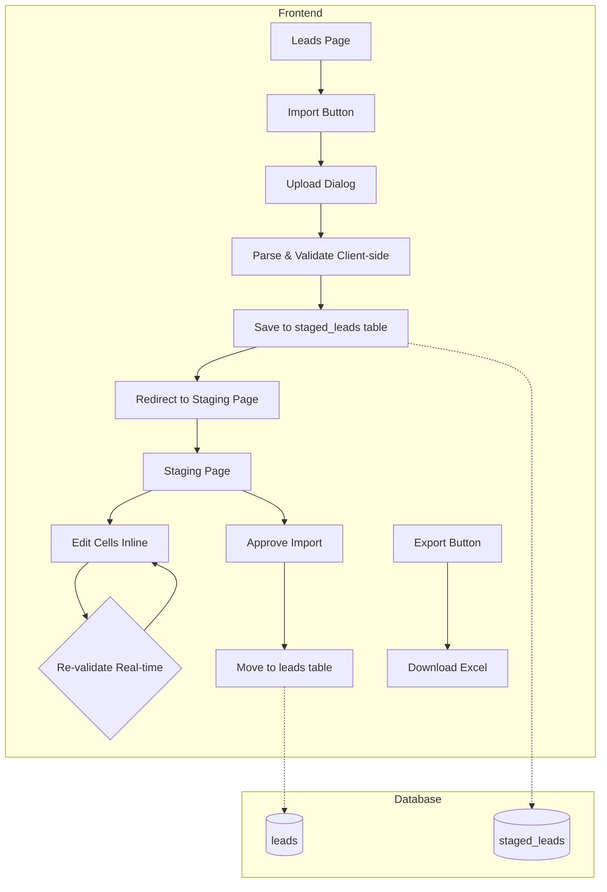

# Lead Excel Import/Export with Staging Workflow

Bulk lead management through Excel files with a staging workflow that ensures data quality before database persistence.

---

## Problem Statement

The current CSV import uploads files directly, processing data immediately without user review. This causes issues because:
- Excel data often has formatting errors (cramped names, missing spaces)
- No opportunity to correct human input errors before saving

**Requirements:**
1. Excel file support (`.xlsx`) + CSV
2. **Client-side real-time validation** for immediate feedback
3. Staging table in database for imported leads pending approval
4. **Dedicated staging page** to review and correct data
5. Export leads to Excel
6. Downloadable template for imports
7. Smart validation for names and company names (detect formatting issues)

---

## Architecture Overview



---

## Validation Rules

> [!NOTE]
> Validation is about data quality/formatting, NOT email verification API calls.

### Core Rule (Required for Valid Lead)

> [!IMPORTANT]
> **All three fields must be non-null for a lead to be valid:**
> - `fullName` — NOT NULL
> - `email` — NOT NULL
> - `companyName` — NOT NULL
>
> If ANY of these fields is empty/null, the lead is marked as **invalid** and cannot be approved.

### Email Validation
- RFC 5322 regex pattern
- Required, non-empty

### Name Validation (Smart Detection)

Detect potential formatting issues in names like:
- `"RagiveGowda P"` → possible missing space before last initial
- `"SanthoshM"` → missing space between first and last name
- `"Mr.Dravid"` → title without space
- `"DR.Putta AnandaG"` → multiple issues (title, cramped suffix)

**Validation Flags:**
| Issue | Detection Pattern | Warning Message |
|-------|-------------------|-----------------|
| Cramped name | Lowercase followed by uppercase mid-word | "Possible missing space" |
| Title prefix | Starts with Mr/Mrs/Ms/Dr without space | "Title may need space" |
| Single letter suffix | Ends with space + single uppercase letter | "Check last name initial" |
| Null/empty | Empty or whitespace only | "Name is required" |

### Company Name Validation
- Required, non-empty
- Detect cramped words (similar logic to names)
- Flag very short values (< 2 chars)

---

## Proposed Changes

### Database Schema

#### [NEW] Staged Leads Collection

**Collection ID:** `staged_leads`

| Attribute | Type | Required | Description |
|-----------|------|----------|-------------|
| `batchId` | String(36) | Yes | Groups rows from same import |
| `rowNumber` | Integer | Yes | Original Excel row number |
| `fullName` | String(255) | Yes | Raw imported name |
| `email` | String(255) | Yes | Raw imported email |
| `companyName` | String(255) | Yes | Raw imported company |
| `metadata` | String(10000) | No | Additional columns as JSON |
| `validationErrors` | String(5000) | No | JSON array of errors |
| `isValid` | Boolean | Yes | Validation status |
| `importedAt` | Datetime | Yes | Upload timestamp |
| `importedBy` | String(36) | No | User ID who uploaded |

---

### Shared Types

#### [NEW] [staged-lead.types.ts](file:///c:/Users/Admin/Documents/Pivotr/Apps/Pivotr%20Mailer/shared/types/staged-lead.types.ts)

```typescript
export type ValidationField = 'fullName' | 'email' | 'companyName';
export type ValidationSeverity = 'error' | 'warning';

export interface FieldValidationIssue {
  field: ValidationField;
  severity: ValidationSeverity;
  message: string;
}

export interface StagedLead {
  $id?: string;
  batchId: string;
  rowNumber: number;
  fullName: string;
  email: string;
  companyName: string;
  metadata?: Record<string, unknown>;
  validationErrors: FieldValidationIssue[];
  isValid: boolean;
  importedAt: string;
  importedBy?: string;
}

export interface ImportBatchSummary {
  batchId: string;
  total: number;
  valid: number;
  invalid: number;
  warnings: number;
  importedAt: string;
}
```

#### [NEW] [lead-validator.ts](file:///c:/Users/Admin/Documents/Pivotr/Apps/Pivotr%20Mailer/shared/validation/lead-validator.ts)

Client-side validation logic (shared):

```typescript
// Email regex (RFC 5322 simplified)
const EMAIL_REGEX = /^[a-zA-Z0-9.!#$%&'*+/=?^_`{|}~-]+@[a-zA-Z0-9](?:[a-zA-Z0-9-]{0,61}[a-zA-Z0-9])?(?:\.[a-zA-Z0-9](?:[a-zA-Z0-9-]{0,61}[a-zA-Z0-9])?)*$/;

// Detect cramped names: lowercase immediately followed by uppercase
const CRAMPED_NAME_REGEX = /[a-z][A-Z]/;

// Title prefixes without space
const TITLE_PREFIX_REGEX = /^(Mr|Mrs|Ms|Dr|Prof)\./i;

export function validateEmail(email: string): FieldValidationIssue[];
export function validateName(name: string): FieldValidationIssue[];
export function validateCompanyName(company: string): FieldValidationIssue[];
export function validateStagedLead(lead: Partial<StagedLead>): FieldValidationIssue[];
```

---

### Backend Functions

#### [NEW] `save-staged-leads` Function

**Purpose:** Save parsed Excel data to `staged_leads` collection.

**Input:** `{ batchId: string, leads: StagedLead[] }`
**Output:** `{ success: boolean, batchId: string }`

#### [NEW] `approve-staged-leads` Function

**Purpose:** Move approved staged leads to `leads` collection, delete from staging.

**Input:** `{ batchId: string, leadIds?: string[] }` (approve all or specific)
**Output:** `{ imported: number, skipped: number }`

#### [NEW] `export-leads` Function

**Purpose:** Generate Excel file with lead data.

**Input:** `{ campaignId?: string, status?: string }`
**Output:** Binary Excel file

#### [MODIFY] `import-leads` (Optional Cleanup)

Remove old direct-import logic if fully replaced by staging workflow.

---

### Frontend Components

#### [NEW] Staging Page Route

**Location:** `frontend/src/routes/leads.staging.tsx`

**Features:**
- TanStack Table with all staged leads grouped by batch
- Inline cell editing with real-time validation
- Validation status icons (error/warning/valid)
- Batch actions: Approve All, Approve Valid Only, Delete Batch
- Filter by validation status

#### [NEW] `ExcelImportDialog` Component

**Location:** `frontend/src/features/leads/components/excel-import-dialog.tsx`

**Flow:**
1. File picker (xlsx/csv)
2. Client-side parse with `xlsx` library
3. Client-side validate each row
4. Save to `staged_leads` via API
5. Redirect to staging page

#### [NEW] `StagingTable` Component

**Location:** `frontend/src/features/leads/components/staging-table.tsx`

**Features:**
- Editable cells using TanStack Table
- Real-time validation on blur/change
- Color-coded validation status
- Inline error messages

#### [NEW] `ExportLeadsButton` Component

**Location:** `frontend/src/features/leads/components/export-leads-button.tsx`

---

### Dependencies

#### Frontend
```bash
cd frontend && bun add xlsx
```

#### Backend (new functions)
```json
{
  "dependencies": {
    "xlsx": "^0.18.5"
  }
}
```

---

## File Structure Summary

```
shared/
├── types/
│   └── staged-lead.types.ts        [NEW]
├── validation/
│   └── lead-validator.ts           [NEW] (client-side validation)
└── constants/
    └── collection.constants.ts     [MODIFY] add STAGED_LEADS

migrations/
└── 007_create_staged_leads.ts      [NEW]

functions/
├── save-staged-leads/              [NEW]
├── approve-staged-leads/           [NEW]
└── export-leads/                   [NEW]

frontend/src/
├── routes/
│   ├── leads.tsx                   [MODIFY] add import/export buttons
│   └── leads.staging.tsx           [NEW] staging page
└── features/leads/components/
    ├── excel-import-dialog.tsx     [NEW]
    ├── staging-table.tsx           [NEW]
    ├── export-leads-button.tsx     [NEW]
    └── csv-uploader.tsx            [DELETE]
```

---

## Verification Plan

### Test 1: Template Download
- Download template from import dialog
- Verify columns: Full Name, Email, Company Name

### Test 2: Client-side Validation
- Enter `"SanthoshM"` → warning about missing space
- Enter `"Mr.Dravid"` → warning about title spacing
- Enter invalid email → error shown immediately
- Enter empty name → error shown immediately

### Test 3: Staging Flow
- Upload Excel with mixed valid/invalid data
- Verify redirect to staging page
- Verify data saved to `staged_leads` collection
- Edit cells, verify real-time revalidation

### Test 4: Approval Flow
- Click "Approve Valid Only"
- Verify valid leads moved to `leads` collection
- Verify staged records deleted

### Test 5: Export
- Click Export on leads page
- Verify Excel downloads with all leads
