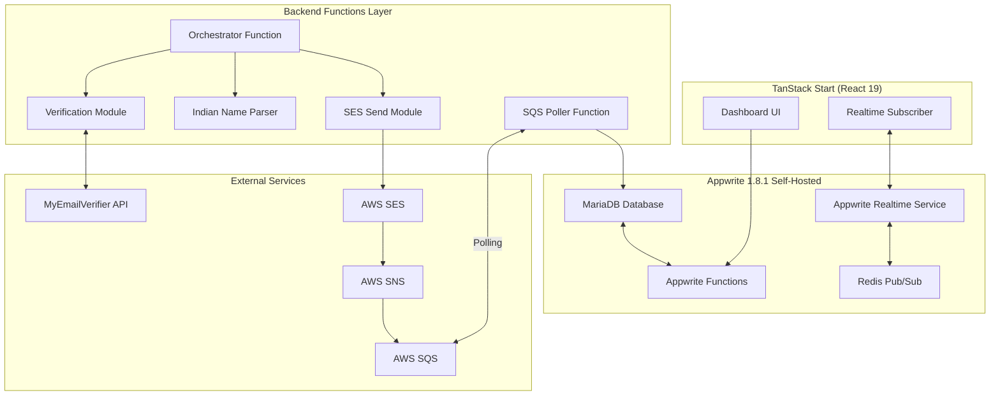
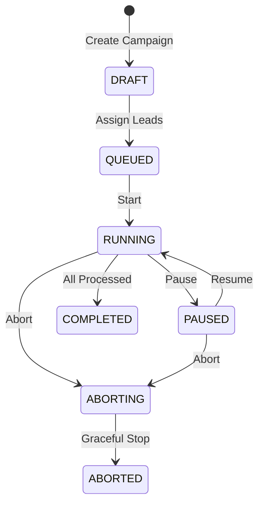
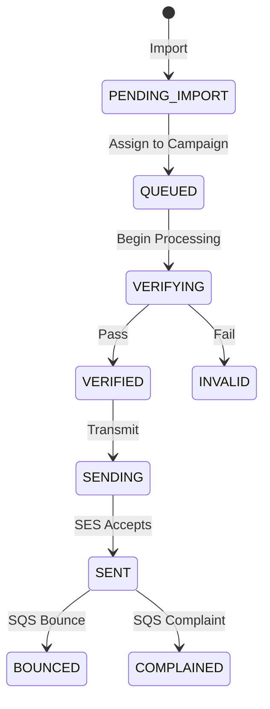

# Phase 1: Backend Foundation — Technical Implementation Plan

> **Project**: Pivotr Mailer — Event-Driven Realtime B2B Email Automation  
> **Phase**: 1 of 3 — Backend Foundation (Priority)  
> **Architecture Pattern**: Event-Driven, ACID-Compliant State Machine  
> **Runtime Environment**: Docker (Windows Mini PC, Appwrite 1.8.1 Self-Hosted)  
> **Version**: 1.1.0 (Revised 2026-01-04)

---

## 1. Executive Technical Summary

Phase 1 establishes the **core backend infrastructure** for an event-driven email automation system. The system must:

1. Persist state atomically across power failures (ACID compliance)
2. Process emails with human-like timing patterns (Gaussian distribution)
3. Pipeline email verification with "Fill Buffer" strategy to minimize latency
4. Ingest asynchronous feedback events (bounces, complaints) from AWS SQS
5. Provide real-time state updates to connected frontend clients via Appwrite Realtime (WebSocket)
6. **Prevent concurrent execution conflicts** via Redis-based campaign locking
7. **Ensure CAN-SPAM/GDPR compliance** via mandatory unsubscribe mechanism

The architecture follows a **finite state machine** model where each lead transitions through deterministic states, with every transition logged to an immutable audit trail with **full message reconstruction capability**.

---

## 2. System Architecture Overview



---

## 3. Appwrite Database Schema Design

### 3.1 Database: `pivotr_mailer`

All collections reside within a single Appwrite Database instance. Document IDs follow Appwrite's native 20-character unique ID format.

---

### 3.2 Collection: `leads`

**Purpose**: Master record for each potential email recipient.

| Attribute | Type | Required | Index | Description |
|-----------|------|----------|-------|-------------|
| `$id` | string | auto | unique | Appwrite document ID |
| `$createdAt` | datetime | auto | yes | Creation timestamp |
| `$updatedAt` | datetime | auto | yes | Last modification timestamp |
| `fullName` | string (255) | yes | — | Raw imported name (e.g., "Mr. Rajesh Kumar Sharma") |
| `parsedFirstName` | string (100) | no | — | Output from Indian Name Parser |
| `email` | string (320) | yes | unique | RFC 5321 compliant email address |
| `companyName` | string (255) | yes | — | Lead's organization |
| `status` | enum | yes | yes | Lead lifecycle state (see State Machine) |
| `verificationResult` | string (50) | no | — | Cached verifier response code |
| `verificationTimestamp` | datetime | no | — | When JIT verification occurred |
| `sesMessageId` | string (100) | no | — | AWS SES Message ID after successful send |
| `bounceType` | string (50) | no | — | Populated via SQS feedback |
| `bounceSubType` | string (50) | no | — | Detailed bounce classification |
| `complaintFeedbackType` | string (50) | no | — | Complaint type from feedback loop |
| `campaignId` | string (36) | no | yes | Foreign key to campaigns collection |
| `queuePosition` | integer | no | yes | Order in sending queue (nullable) |
| `processingStartedAt` | datetime | no | — | Timestamp when processing began |
| `processedAt` | datetime | no | — | Timestamp when fully processed |
| `errorMessage` | string (1000) | no | — | Error details if processing failed |
| `isUnsubscribed` | boolean | yes | yes | Unsubscribe flag (default: false) |
| `unsubscribedAt` | datetime | no | — | Timestamp of unsubscribe action |
| `metadata` | JSON | no | — | Extensible key-value store |

**Lead Status Enum Values**:
```
PENDING_IMPORT    → Initial state after data ingestion
QUEUED            → Assigned to campaign queue
VERIFYING         → Currently undergoing email verification
VERIFIED          → Passed verification, awaiting send
RISKY             → Catch-all domain (requires manual approval or campaign setting)
INVALID           → Failed verification (invalid/spamtrap/disposable)
SENDING           → Email transmission in progress (TIMEOUT: 60s → revert to VERIFIED)
SENT              → Successfully delivered to SES
BOUNCED           → Hard/soft bounce received via SQS
COMPLAINED        → Complaint notification received
SKIPPED           → Manually skipped or failed validation
UNSUBSCRIBED      → Lead opted out via unsubscribe link
ERROR             → Processing error occurred
```

> [!WARNING]
> **SENDING Status Timeout**: If a lead remains in `SENDING` for >60 seconds without `sesMessageId` being set, the recovery process MUST revert it to `VERIFIED` for retry. This prevents permanent stalls from mid-execution crashes.

**Indexes**:
- `status_idx`: Single-field index on `status` for queue filtering
- `unsubscribed_idx`: Single-field index on `isUnsubscribed` for filtering
- `campaign_queue_idx`: Compound index on `[campaignId, status, queuePosition]` for ordered retrieval
- `email_unique_idx`: Unique index on `email` to prevent duplicates

---

### 3.3 Collection: `campaigns`

**Purpose**: Represents a discrete sending batch with specific configuration.

| Attribute | Type | Required | Index | Description |
|-----------|------|----------|-------|-------------|
| `$id` | string | auto | unique | Campaign identifier |
| `$createdAt` | datetime | auto | yes | Campaign creation time |
| `name` | string (255) | yes | — | Human-readable campaign name |
| `status` | enum | yes | yes | Campaign state |
| `subjectTemplate` | string (998) | yes | — | Spintax-enabled subject line |
| `bodyTemplate` | text | yes | — | Spintax-enabled HTML/plain body |
| `senderEmail` | string (320) | yes | — | Verified SES sender identity |
| `senderName` | string (255) | yes | — | Display name for From header |
| `totalLeads` | integer | yes | — | Count at campaign creation |
| `processedCount` | integer | yes | — | Successfully sent count |
| `skippedCount` | integer | yes | — | Verification failures |
| `errorCount` | integer | yes | — | Processing errors |
| `pausedAt` | datetime | no | — | Timestamp of last pause |
| `resumePosition` | integer | no | — | Queue position to resume from |
| `minDelayMs` | integer | yes | — | Gaussian lower bound (milliseconds) |
| `maxDelayMs` | integer | yes | — | Gaussian upper bound (milliseconds) |
| `gaussianMean` | float | no | — | Custom mean (default: midpoint) |
| `gaussianStdDev` | float | no | — | Custom standard deviation |
| `allowCatchAll` | boolean | yes | — | If true, RISKY leads are sent; if false, skipped |
| `lastActivityAt` | datetime | no | — | Timestamp of last state transition |
| `completedAt` | datetime | no | — | Campaign completion timestamp |

**Campaign Status Enum Values**:
```
DRAFT             → Template defined, not yet started
QUEUED            → Leads assigned, ready to start
RUNNING           → Actively processing leads
PAUSED            → User-initiated pause
ABORTING          → Graceful shutdown in progress
ABORTED           → Terminated before completion
COMPLETED         → All leads processed
ERROR             → Unrecoverable error state
```

---

### 3.4 Collection: `logs`

**Purpose**: Immutable audit trail for every system action.

| Attribute | Type | Required | Index | Description |
|-----------|------|----------|-------|-------------|
| `$id` | string | auto | unique | Log entry ID |
| `$createdAt` | datetime | auto | yes | Log timestamp |
| `eventType` | enum | yes | yes | Action classification |
| `leadId` | string (36) | no | yes | Reference to leads collection |
| `campaignId` | string (36) | no | yes | Reference to campaigns collection |
| `severity` | enum | yes | yes | INFO, WARN, ERROR, FATAL |
| `message` | string (1000) | yes | — | Human-readable description |
| `resolvedSubject` | string (998) | no | — | **Actual subject after Spintax resolution** |
| `resolvedBody` | text | no | — | **Full resolved email body for audit reconstruction** |
| `templateVariables` | JSON | no | — | Variables used: `{firstName, company, etc}` |
| `verifierResponse` | JSON | no | — | Raw MyEmailVerifier API response |
| `sesResponse` | JSON | no | — | Raw SES API response |
| `sqsMessage` | JSON | no | — | Raw SQS notification payload |
| `processingTimeMs` | integer | no | — | Duration of operation |
| `errorDetails` | JSON | no | — | Stack trace, error codes |
| `metadata` | JSON | no | — | Extensible context data |

> [!IMPORTANT]
> **Audit Trail Compliance**: `resolvedBody` stores the EXACT text sent to the recipient. This is critical for debugging Spintax errors, investigating complaints, and legal compliance. Do NOT hash or truncate.

**Event Type Enum Values**:
```
LEAD_IMPORTED         → New lead added to system
LEAD_QUEUED           → Lead assigned to campaign queue
VERIFICATION_STARTED  → JIT verification initiated
VERIFICATION_PASSED   → Email validated successfully
VERIFICATION_FAILED   → Email deemed invalid/risky
EMAIL_SENDING         → SES API call initiated
EMAIL_SENT            → SES accepted message
EMAIL_FAILED          → SES rejected message
BOUNCE_RECEIVED       → SQS bounce notification processed
COMPLAINT_RECEIVED    → SQS complaint notification processed
CAMPAIGN_STARTED      → Campaign execution began
CAMPAIGN_PAUSED       → User paused campaign
CAMPAIGN_RESUMED      → Campaign resumed from pause
CAMPAIGN_ABORTED      → Campaign forcefully terminated
CAMPAIGN_COMPLETED    → All leads processed
SYSTEM_ERROR          → Unexpected system failure
```

---

### 3.5 Collection: `metrics`

**Purpose**: Pre-aggregated statistics for dashboard consumption (no on-the-fly calculation).

| Attribute | Type | Required | Index | Description |
|-----------|------|----------|-------|-------------|
| `$id` | string | auto | unique | Metrics document ID (singleton or per-campaign) |
| `scope` | enum | yes | yes | GLOBAL or CAMPAIGN |
| `scopeId` | string (36) | no | yes | Campaign ID if scope=CAMPAIGN |
| `totalLeadsImported` | integer | yes | — | Cumulative leads in system |
| `totalEmailsSent` | integer | yes | — | Successfully transmitted |
| `totalBounces` | integer | yes | — | Hard + soft bounces |
| `totalHardBounces` | integer | yes | — | Permanent failures |
| `totalSoftBounces` | integer | yes | — | Temporary failures |
| `totalComplaints` | integer | yes | — | Spam/abuse reports |
| `totalVerificationPassed` | integer | yes | — | Valid emails |
| `totalVerificationFailed` | integer | yes | — | Invalid/risky emails |
| `totalSkipped` | integer | yes | — | Processing skips |
| `totalErrors` | integer | yes | — | System errors |
| `verifierCreditsUsed` | integer | yes | — | MyEmailVerifier API calls |
| `lastUpdatedAt` | datetime | yes | — | Last metric update |

**Update Strategy**: Atomic increment operations triggered by Appwrite Function events — NEVER via full table scans.

---

### 3.6 Collection: `settings`

**Purpose**: Singleton configuration document for system-wide settings.

| Attribute | Type | Required | Description |
|-----------|------|----------|-------------|
| `$id` | string | fixed | Always "global_settings" |
| `awsSesRegion` | string (50) | yes | AWS region for SES |
| `awsSesAccessKeyId` | string (100) | encrypted | IAM access key |
| `awsSesSecretAccessKey` | string (200) | encrypted | IAM secret key |
| `awsSqsQueueUrl` | string (500) | yes | SQS queue URL for feedback |
| `awsSqsRegion` | string (50) | yes | AWS region for SQS |
| `myEmailVerifierApiKey` | string (200) | encrypted | MEV API key |
| `defaultMinDelayMs` | integer | yes | Default Gaussian min (e.g., 60000) |
| `defaultMaxDelayMs` | integer | yes | Default Gaussian max (e.g., 180000) |
| `sqsPollingIntervalMs` | integer | yes | SQS poll frequency |
| `verifierTimeoutMs` | integer | yes | MEV API timeout |
| `sesTimeoutMs` | integer | yes | SES API timeout |
| `maxRetries` | integer | yes | Retry count before failure |
| `retryBackoffMs` | integer | yes | Base backoff duration |

> [!IMPORTANT]
> Sensitive fields (`awsSesSecretAccessKey`, `myEmailVerifierApiKey`) must be stored using Appwrite's secure environment variables in production.

---

## 4. Indian Name Parser Module

### 4.1 Parser Algorithm Pipeline

```
┌─────────────────────────────────────────────────────────────┐
│                    INPUT: Raw Full Name                      │
└─────────────────────────────────────────────────────────────┘
                              │
                              ▼
┌─────────────────────────────────────────────────────────────┐
│  STAGE 1: Normalization                                     │
│  • Trim whitespace, normalize multiple spaces               │
│  • Convert to UTF-8 NFC form                                │
│  • Remove invisible Unicode characters (U+200B, etc.)       │
└─────────────────────────────────────────────────────────────┘
                              │
                              ▼
┌─────────────────────────────────────────────────────────────┐
│  STAGE 2: Honorific & Title Removal                         │
│  • Strip prefixes: Mr., Mrs., Ms., Shri, Shrimati, Smt.,   │
│    Dr., Prof., Sri, Kumari, Master, CA, Adv., Er.           │
│  • Strip suffixes: Jr., Sr., PhD, MBA, IAS, IPS, IFS        │
└─────────────────────────────────────────────────────────────┘
                              │
                              ▼
┌─────────────────────────────────────────────────────────────┐
│  STAGE 3: Format Detection & Reordering                     │
│  • Detect "Last, First Middle" pattern (comma-separated)    │
│  • Detect initial patterns: "K. Ramachandran" → Initial=K   │
│  • Reorder to "First Middle Last" canonical form            │
└─────────────────────────────────────────────────────────────┘
                              │
                              ▼
┌─────────────────────────────────────────────────────────────┐
│  STAGE 4: Initial Expansion Handling                        │
│  • If first token is single char + period: Skip to next     │
│  • South Indian pattern: Initial = Father's name            │
│  • Return first full word after initials                    │
└─────────────────────────────────────────────────────────────┘
                              │
                              ▼
┌─────────────────────────────────────────────────────────────┐
│  STAGE 5: Common Surname Detection                          │
│  • Load dictionary: Singh, Sharma, Patel, Reddy,            │
│    Iyer, Iyengar, Rao, Nair, Menon, Pillai, etc.           │
│  • If first token is surname → return second token          │
│                                                             │
│  ⚠️ WARNING: "Kumar" is commonly a FIRST NAME in India     │
│     (e.g., "Kumar Sanu"). Do NOT use it as a split point.  │
│     Only use it as surname if it's the LAST token.          │
└─────────────────────────────────────────────────────────────┘
                              │
                              ▼
┌─────────────────────────────────────────────────────────────┐
│  STAGE 6: Muslim Name Pattern Detection                     │
│  • Detect: Mohammad, Mohammed, Md., Sheikh, Khan, etc.      │
│  • "Mohammad Abdul Rahman" → consider "Abdul" or "Rahman"   │
└─────────────────────────────────────────────────────────────┘
                              │
                              ▼
┌─────────────────────────────────────────────────────────────┐
│  STAGE 7: Final Extraction                                  │
│  • Return the identified "first name" token                 │
│  • Apply Title Case normalization                           │
│  • Fallback: Return first non-initial token                 │
└─────────────────────────────────────────────────────────────┘
```

---

## 5. External Integration Modules

### 5.1 MyEmailVerifier Integration

**API Endpoint**: `https://api.myemailverifier.com/verify/single/json`

**Response Mapping**:

| status_code | internal_status | action |
|-------------|-----------------|--------|
| ok | VERIFIED | Proceed to send |
| invalid | INVALID | Skip lead, log reason |
| catch_all | **RISKY** | Check `campaign.allowCatchAll` setting |
| unknown | RETRY | Retry with backoff (max 3) |
| spamtrap | INVALID | Skip lead, flag HIGH-RISK in logs |
| disposable | INVALID | Skip lead, log reason |

> [!CAUTION]
> **Catch-All (Accept-All) Domains**: These domains accept all mail initially but often silently bounce or delete later, damaging SES reputation. Default behavior: Mark as `RISKY` and skip unless `campaign.allowCatchAll = true`.

**Timeout**: 10,000ms default, circuit breaker after 3 consecutive failures.

### 5.2 AWS SES Integration

**API Method**: `SendEmail` (v2 SDK)

**Response Handling**:
- Success: MessageId returned → Store in lead.sesMessageId → Mark SENT
- Throttled: ThrottlingException → Exponential backoff, retry
- Rejected: MessageRejected → Log error, mark lead ERROR
- AccountSuspended: Halt campaign, alert user

### 5.3 AWS SQS Polling (Bounce/Complaint Feedback)

**Queue Configuration**:
- Queue Type: Standard
- Visibility Timeout: 60 seconds
- Receive Wait Time: 20 seconds (long polling)
- Dead Letter Queue: Configure for messages failing 3 times

**Processing Logic**:
1. Deserialize SNS message from SQS body
2. Check notificationType: "Bounce" | "Complaint"
3. Extract mail.messageId (this is lead.sesMessageId)
4. Query leads collection by sesMessageId
5. Update lead.status → BOUNCED or COMPLAINED
6. Increment metrics atomically
7. Delete message from SQS queue

---

## 6. Event-Driven Orchestrator (Sending Engine)

### 6.1 Campaign State Machine



### 6.2 Lead State Machine



### 6.3 Gaussian Distribution Timer

**Algorithm (Box-Muller Transform)**:
```
Given:
  minDelay = 60,000 ms (1 minute)
  maxDelay = 180,000 ms (3 minutes)
  
Derived:
  mean (μ) = (minDelay + maxDelay) / 2 = 120,000 ms
  stdDev (σ) = (maxDelay - minDelay) / 6 = 20,000 ms
  
Formula:
  1. Generate u1, u2 ∈ (0, 1)
  2. z = sqrt(-2 * ln(u1)) * cos(2π * u2)
  3. delay = μ + σ * z
  4. Clamp to [minDelay, maxDelay]
```

### 6.4 JIT Verification Pipeline ("Fill Buffer" Strategy)

The pipeline must NOT stall if the pre-verified lead fails. Implement a **Fill Buffer** approach:

```
Timeline (Happy Path):
  T=0: VERIFY Lead A → VERIFIED → Start delay timer
  T=5s: During delay → VERIFY Lead B → VERIFIED (buffer filled)
  T=60s: Delay expires → SEND Lead A
  T=65s: Lead B already verified → Proceed immediately

Timeline (Lead B Invalid):
  T=0: VERIFY Lead A → VERIFIED → Start delay timer  
  T=5s: During delay → VERIFY Lead B → INVALID (skip)
  T=6s: Buffer empty → VERIFY Lead C → VERIFIED (buffer refilled)
  T=60s: Delay expires → SEND Lead A
  T=65s: Lead C already verified → Proceed immediately
```

**Buffer Logic**:
- Maintain `verifiedBuffer: Lead | null`
- After each lead processed, check if buffer is empty
- If empty AND more leads in queue AND time remaining in delay: fetch and verify next
- Repeat until buffer filled OR no time remaining OR queue exhausted

### 6.5 Orchestrator Concurrency Control (Singleton Lock)

> [!WARNING]
> **Double-Send Risk**: Appwrite Functions can trigger multiple overlapping instances. Without locking, two instances may grab the same lead and send duplicate emails.

**Locking Strategy (Redis-based)**:
```
Before processing any campaign:
1. Attempt to SET key: `campaign_lock_{campaignId}`
   - Value: `{instanceId}_{timestamp}`
   - NX (only if not exists)
   - EX 120 (TTL: 2 minutes)

2. If SET succeeds: Proceed with processing
   - Refresh TTL every 30 seconds during processing
   - DELETE key on completion/pause/abort

3. If SET fails: Another instance holds lock
   - Log warning and exit gracefully
   - Do NOT process any leads
```

**Redis Key Pattern**: `pivotr:lock:campaign:{campaignId}`

### 6.6 ACID Compliance & Power Failure Recovery

On system startup:
1. Query campaigns where `status = RUNNING`
2. For each campaign:
   a. **Check for stale locks**: If lock exists but older than 5 minutes, forcefully release
   b. Query leads where `status = SENDING`:
      - If `processingStartedAt` > 60 seconds ago AND no `sesMessageId`: Revert to `VERIFIED`
      - If `sesMessageId` exists: Mark as SENT, update metrics
3. Resume campaign from `resumePosition`

### 6.7 Metric Updates (Synchronous, Not Event-Driven)

> [!IMPORTANT]
> Metrics MUST be updated **inside the Orchestrator function** immediately after lead status updates — NOT via asynchronous Event Triggers. This prevents metric drift if event functions fail.

```
After updateDocument(lead, {status: 'SENT'}):
  → Immediately call updateDocument(metrics, {totalEmailsSent: ++})
  → Both in same function execution context
```

---

## 7. Appwrite Realtime Integration

**Subscription Channels**:
```
databases.<database_id>.collections.leads.documents
databases.<database_id>.collections.campaigns.documents
databases.<database_id>.collections.metrics.documents
databases.<database_id>.collections.logs.documents
```

**WebSocket Endpoint**: `ws://localhost:5000/v1/realtime`

---

## 8. Appwrite Functions Architecture

| Function Name | Trigger | Purpose |
|---------------|---------|---------|
| `orchestrator` | HTTP (POST) | Start/Pause/Resume/Abort campaigns |
| `process-lead` | Schedule (Internal) | Process individual lead |
| `sqs-poller` | Schedule (Cron: */1 * * * *) | Poll AWS SQS for feedback |
| `import-leads` | HTTP (POST) | Bulk CSV/Excel import |
| `unsubscribe-lead` | HTTP (GET) | Handle unsubscribe link clicks |
| `verify-email` | Internal | JIT email verification |
| `send-email` | Internal | AWS SES transmission |
| `parse-name` | Internal | Indian name parsing |

> [!IMPORTANT]
> **Function Timeout Configuration**: The `orchestrator` and `process-lead` functions MUST be configured with a **900-second (15 minute) timeout** in `appwrite.json` or Appwrite Console. Default timeouts (15-30s) will kill the process during Gaussian delays.

---

### 8.2 Redis Networking for Locking

The Redis instance used for campaign locking must be accessible from Appwrite Function containers:

**Option A (Dedicated Redis Service)**:
Add a separate Redis service to `docker-compose.yml` with explicit network exposure to the Appwrite network.

**Option B (Fallback to Database Locking)**:
If Redis networking is blocked, implement locking via Appwrite Database using a `locks` collection with TTL-based document expiry.

---

## 9. Data Sanitization Pipeline

1. **Trim whitespace** from all fields
2. **Remove invisible characters**: U+200B, U+200C, U+200D, U+FEFF, U+00AD
3. **Email validation**: RFC 5322 regex, TLD verification
4. **Duplicate detection**: Query by email, reject if exists in same campaign

---

## 10. Spintax Resolution Engine

**Syntax**:
- Standard: `{option1|option2|option3}`
- Nested: `{Hi|Hello {there|friend}|Hey}`
- Escaped: `{Option with \| pipe}`

**Variable Injection** (after Spintax):
- `{{FirstName}}` → parsedFirstName
- `{{Company}}` → companyName
- `{{FullName}}` → fullName
- `{{UnsubscribeLink}}` → **REQUIRED** — Generated URL to `unsubscribe-lead` function

> [!CAUTION]
> **CAN-SPAM/GDPR Compliance**: Every email MUST include `{{UnsubscribeLink}}`. The template editor should validate this before campaign start.

**Unsubscribe Link Format**:
```
https://{APPWRITE_DOMAIN}/v1/functions/{UNSUBSCRIBE_FUNCTION_ID}/executions?leadId={LEAD_ID}&token={HMAC_TOKEN}
```
- `token`: HMAC-SHA256 of leadId using a secret, prevents unauthorized unsubscribes

---

## 11. Error Handling & Retry Strategy

### Exponential Backoff

```
Attempt 1: ~2,000 ms
Attempt 2: ~4,000 ms
Attempt 3: ~8,000 ms
Attempt 4: ~16,000 ms
Attempt 5: ~32,000 ms (max before 5 min cap)
```

### Circuit Breaker Pattern

- **CLOSED**: Normal operation, track failures
- **OPEN**: Failures ≥ 3, all requests fail immediately
- **HALF_OPEN**: After 60s, allow one probe request

---

## 12. Directory Structure

```
Pivotr Mailer/
├── functions/
│   ├── orchestrator/
│   │   └── src/
│   │       ├── main.ts
│   │       ├── campaign-handler.ts
│   │       ├── lead-processor.ts
│   │       ├── delay-calculator.ts
│   │       └── campaign-lock.ts      # Redis locking logic
│   │
│   ├── sqs-poller/
│   │   └── src/
│   │       ├── main.ts
│   │       ├── bounce-handler.ts
│   │       └── complaint-handler.ts
│   │
│   ├── import-leads/
│   │   └── src/
│   │       ├── main.ts
│   │       ├── csv-parser.ts
│   │       ├── excel-parser.ts
│   │       └── sanitizer.ts
│   │
│   ├── unsubscribe-lead/            # NEW: Unsubscribe endpoint
│   │   └── src/
│   │       ├── main.ts               # HTTP GET handler
│   │       ├── token-validator.ts    # HMAC token verification
│   │       └── confirmation-page.ts  # HTML response generator
│   │
│   └── _shared/
│       ├── name-parser/
│       │   ├── parser.ts
│       │   ├── honorifics.ts
│       │   └── surnames.ts
│       ├── email-verifier/
│       │   ├── client.ts
│       │   └── types.ts
│       ├── ses-client/
│       │   ├── client.ts
│       │   └── types.ts
│       ├── sqs-client/
│       │   ├── client.ts
│       │   └── types.ts
│       ├── spintax/
│       │   ├── resolver.ts
│       │   └── variable-injector.ts
│       ├── database/
│       │   └── repositories/
│       │       ├── lead.repository.ts
│       │       ├── campaign.repository.ts
│       │       ├── log.repository.ts
│       │       └── metrics.repository.ts
│       └── errors/
│           ├── base-error.ts
│           └── error-handler.ts
│
├── shared/
│   ├── types/
│   │   ├── lead.types.ts
│   │   ├── campaign.types.ts
│   │   ├── log.types.ts
│   │   ├── metrics.types.ts
│   │   └── settings.types.ts
│   ├── constants/
│   │   ├── status.constants.ts
│   │   ├── event.constants.ts
│   │   └── collection.constants.ts
│   └── index.ts
│
└── migrations/
    ├── 001_create_leads.ts
    ├── 002_create_campaigns.ts
    ├── 003_create_logs.ts
    ├── 004_create_metrics.ts
    ├── 005_create_settings.ts
    └── 006_create_indexes.ts
```

---

## 13. Dependencies

**Runtime**:
- `@aws-sdk/client-ses` — AWS SES v2 SDK
- `@aws-sdk/client-sqs` — AWS SQS SDK
- `node-appwrite` — Appwrite Server SDK
- `ioredis` — Redis client for campaign locking
- `xlsx` — Excel file parsing
- `csv-parse` — CSV file parsing

**Dev**:
- `typescript`
- `vitest`
- `@types/node`

---

## 14. Verification Plan

### Unit Tests
- Indian Name Parser (50+ variations)
- Spintax Resolver (nested, escaped pipes)
- Gaussian Distribution (10,000 sample validation)

### Integration Tests
- Email Verification Flow (mock MEV)
- SES Send Flow (mock AWS SDK)
- SQS Polling Flow (mock notifications)

### ACID Compliance Tests
- Start campaign with 10 leads
- Kill function mid-processing
- Verify no duplicates, resume from correct position

---

*Document Version: 1.0.0*  
*Created: 2026-01-04*
