# Add/Edit Individual Leads Feature Plan

## Overview

Add functionality to the Leads page that allows users to manually add and edit individual leads through a dialog form, complementing the existing bulk import functionality.

## Current Architecture Analysis

### Backend (Already Exists)
- **Create Endpoint**: `POST /api/leads`
- **Update Endpoint**: `PUT /api/leads/{id}`
- **Handler**: [`lambda/api/leads/src/index.ts`](lambda/api/leads/src/index.ts)
- **Validation**: 
  - Required fields: `fullName`, `email`, `companyName`
  - Email format validation
  - Auto-trims whitespace
  - Auto-generates UUID and timestamps (create only)
  - Default status: `PENDING_IMPORT` (create only)

### Frontend Hooks (Already Exist)
- **Create**: [`useCreateLead()`](frontend/src/features/leads/hooks/useLeads.ts:236) 
- **Update**: [`useUpdateLead()`](frontend/src/features/leads/hooks/useLeads.ts:255)
- Both invalidate the leads query on success

### Lead Type Definition
```typescript
interface Lead {
  id: string;
  fullName: string;        // Required
  email: string;           // Required
  companyName: string;     // Required
  phoneNumber?: string;    // Optional
  leadType?: LeadType;     // Optional: HARDWARE | SOFTWARE | BOTH
  status: LeadStatus;
  campaignId?: string;
  parsedFirstName?: string;
  createdAt: string;
  updatedAt: string;
}
```

## Implementation Plan

### 1. Create LeadFormDialog Component (Unified Add/Edit)

**File**: `frontend/src/features/leads/components/LeadFormDialog.tsx`

**Design Decision**: Use a single dialog component that handles both add and edit modes. This reduces code duplication and ensures consistent UX.

**Props**:
```typescript
interface LeadFormDialogProps {
  open: boolean;
  onOpenChange: (open: boolean) => void;
  mode: 'add' | 'edit';
  lead?: Lead;  // Required for edit mode
  onSuccess?: () => void;
}
```

**Features**:
- Dialog with form for entering/editing lead details
- Form validation using Zod schema
- Uses shadcn/ui components (Dialog, Input, Label, Button, Select)
- Follows existing patterns from [`AssignLeadsDialog.tsx`](frontend/src/features/campaigns/components/AssignLeadsDialog.tsx)
- Populates form with existing data in edit mode
- Shows loading state during submission

**Form Fields**:
| Field | Type | Required | Validation |
|-------|------|----------|------------|
| Full Name | text | Yes | Min 2 chars, max 100 chars |
| Email | email | Yes | Valid email format |
| Company Name | text | Yes | Min 2 chars, max 100 chars |
| Phone Number | tel | No | Optional, min 7 chars |
| Lead Type | select | No | HARDWARE / SOFTWARE / BOTH |

### 2. Create Zod Schema for Validation

**File**: `frontend/src/features/leads/schemas/leadSchema.ts`

```typescript
import { z } from "zod";

export const leadFormSchema = z.object({
  fullName: z.string()
    .min(2, "Name must be at least 2 characters")
    .max(100, "Name must be less than 100 characters"),
  email: z.string()
    .email("Invalid email address")
    .max(255, "Email must be less than 255 characters"),
  companyName: z.string()
    .min(2, "Company name must be at least 2 characters")
    .max(100, "Company name must be less than 100 characters"),
  phoneNumber: z.string()
    .optional()
    .refine(val => !val || val.length >= 7, "Phone number must be at least 7 characters"),
  leadType: z.enum(["HARDWARE", "SOFTWARE", "BOTH"]).optional().nullable(),
});

export type LeadFormData = z.infer<typeof leadFormSchema>;
```

### 3. Update Leads Page

**File**: `frontend/src/routes/_app/leads/index.tsx`

**Changes**:
1. Import LeadFormDialog component
2. Add state for dialog open/close and mode
3. Add "Add Lead" button in header
4. Wire up the useCreateLead and useUpdateLead hooks

**Button Placement**:
```
[Refresh] [Template] [Export] [Add Lead] [Import Leads]
```

### 4. Update LeadsDataTable for Edit Action

**File**: `frontend/src/features/leads/components/LeadsDataTable.tsx`

**Changes**:
1. Add "Edit" action button/icon in each row (or in a dropdown menu)
2. Add callback prop `onEditLead` to handle edit action
3. Pass lead data to parent for opening edit dialog

**Edit Action Placement Options**:
- Option A: Add edit icon button as first column
- Option B: Add dropdown menu with edit action (kebab menu)
- Option C: Edit on double-click (in addition to row click)

**Recommended**: Option B - Dropdown menu with kebab icon, cleaner UI

### 5. Component Structure

```
frontend/src/features/leads/
    components/
    LeadFormDialog.tsx    # NEW - Unified add/edit dialog
    LeadsDataTable.tsx    # MODIFY - Add edit action
    BulkActionsToolbar.tsx
    LeadStatusBadge.tsx
    StagingLeadsDataTable.tsx
hooks/
    useLeads.ts           # Existing hooks (useCreateLead, useUpdateLead)
schemas/
    leadSchema.ts         # NEW
types/
    index.ts
```

## UI/UX Design

### Add Lead Dialog
```
+---------------------------------------------+
|  Add New Lead                          [X]  |
+---------------------------------------------+
|                                             |
|  Full Name *                                |
|  +-------------------------------------+    |
|  | John Doe                            |    |
|  +-------------------------------------+    |
|                                             |
|  Email *                                    |
|  +-------------------------------------+    |
|  | john.doe@example.com                |    |
|  +-------------------------------------+    |
|                                             |
|  Company Name *                             |
|  +-------------------------------------+    |
|  | Acme Corporation                    |    |
|  +-------------------------------------+    |
|                                             |
|  Phone Number                               |
|  +-------------------------------------+    |
|  | +1 555-123-4567                     |    |
|  +-------------------------------------+    |
|                                             |
|  Lead Type                                  |
|  +-------------------------------------+    |
|  | Select type...                    v |    |
|  +-------------------------------------+    |
|                                             |
+---------------------------------------------+
|                    [Cancel]  [Add Lead]     |
+---------------------------------------------+
```

### Edit Lead Dialog
```
+---------------------------------------------+
|  Edit Lead                             [X]  |
+---------------------------------------------+
|                                             |
|  Full Name *                                |
|  +-------------------------------------+    |
|  | John Smith                          |    |
|  +-------------------------------------+    |
|                                             |
|  Email *                                    |
|  +-------------------------------------+    |
|  | john.smith@example.com              |    |
|  +-------------------------------------+    |
|                                             |
|  Company Name *                             |
|  +-------------------------------------+    |
|  | Acme Corporation                    |    |
|  +-------------------------------------+    |
|                                             |
|  Phone Number                               |
|  +-------------------------------------+    |
|  | +1 555-999-8888                     |    |
|  +-------------------------------------+    |
|                                             |
|  Lead Type                                  |
|  +-------------------------------------+    |
|  | SOFTWARE                          v |    |
|  +-------------------------------------+    |
|                                             |
+---------------------------------------------+
|                   [Cancel]  [Save Changes]  |
+---------------------------------------------+
```

### Row Actions (Edit Dropdown)
```
+----------------------------------------------------------+
| [ ] | Name      | Email        | Company  | Status | ... |
|     | John Doe  | john@...     | Acme     | VERIFIED | v |
+----------------------------------------------------------+
                                                          |
                                                          v
                                                    +----------+
                                                    | Edit     |
                                                    | Delete   |
                                                    +----------+
```

## User Flow Diagram

```mermaid
flowchart TD
    subgraph Add Flow
        A1[User clicks Add Lead button] --> B1[Dialog opens in add mode]
        B1 --> C1[User fills form]
        C1 --> D1{Validation}
        D1 -->|Invalid| E1[Show field errors]
        E1 --> C1
        D1 -->|Valid| F1[User clicks Add Lead]
        F1 --> G1[useCreateLead mutation]
        G1 --> H1{API Response}
        H1 -->|Success| I1[Show success toast]
        I1 --> J1[Close dialog]
        J1 --> K1[Refresh leads list]
        H1 -->|Error| L1[Show error toast]
        L1 --> B1
    end

    subgraph Edit Flow
        A2[User clicks Edit on row] --> B2[Dialog opens in edit mode]
        B2 --> C2[Form populated with lead data]
        C2 --> D2[User modifies form]
        D2 --> E2{Validation}
        E2 -->|Invalid| F2[Show field errors]
        F2 --> D2
        E2 -->|Valid| G2[User clicks Save Changes]
        G2 --> H2[useUpdateLead mutation]
        H2 --> I2{API Response}
        I2 -->|Success| J2[Show success toast]
        J2 --> K2[Close dialog]
        K2 --> L2[Refresh leads list]
        I2 -->|Error| M2[Show error toast]
        M2 --> B2
    end
```



## Technical Details

### State Management
- Dialog open state: `useState<boolean>`
- Dialog mode: `useState<'add' | 'edit'>`
- Selected lead for edit: `useState<Lead | null>`
- Form state: React Hook Form with Zod resolver
- Mutation state: TanStack Query via `useCreateLead` / `useUpdateLead`

### Error Handling
- Client-side validation errors: Display below each field
- Server-side errors: Toast notification via sonner
- Network errors: Toast notification with retry option

### Success Feedback
- Add: Toast notification "Lead added successfully"
- Edit: Toast notification "Lead updated successfully"
- Dialog closes automatically
- Leads table refreshes via query invalidation

## Files to Create/Modify

### New Files
1. `frontend/src/features/leads/components/LeadFormDialog.tsx`
2. `frontend/src/features/leads/schemas/leadSchema.ts`

### Modified Files
1. `frontend/src/routes/_app/leads/index.tsx` - Add button, dialog, and state management
2. `frontend/src/features/leads/components/LeadsDataTable.tsx` - Add edit action to rows

## Dependencies
All required dependencies are already installed:
- `zod` - Schema validation
- `@hookform/resolvers` - Zod resolver for react-hook-form
- `react-hook-form` - Form management
- `sonner` - Toast notifications
- shadcn/ui components (Dialog, Input, Label, Button, Select, DropdownMenu)

## Testing Checklist
- [ ] Add dialog opens/closes correctly
- [ ] Edit dialog opens with pre-populated data
- [ ] Form validation works for all fields
- [ ] Required field validation
- [ ] Email format validation
- [ ] Successful lead creation
- [ ] Successful lead update
- [ ] Error handling for API failures
- [ ] Toast notifications appear
- [ ] Leads table refreshes after create/update
- [ ] Dialog resets form after successful submission
- [ ] Edit action accessible from table rows
